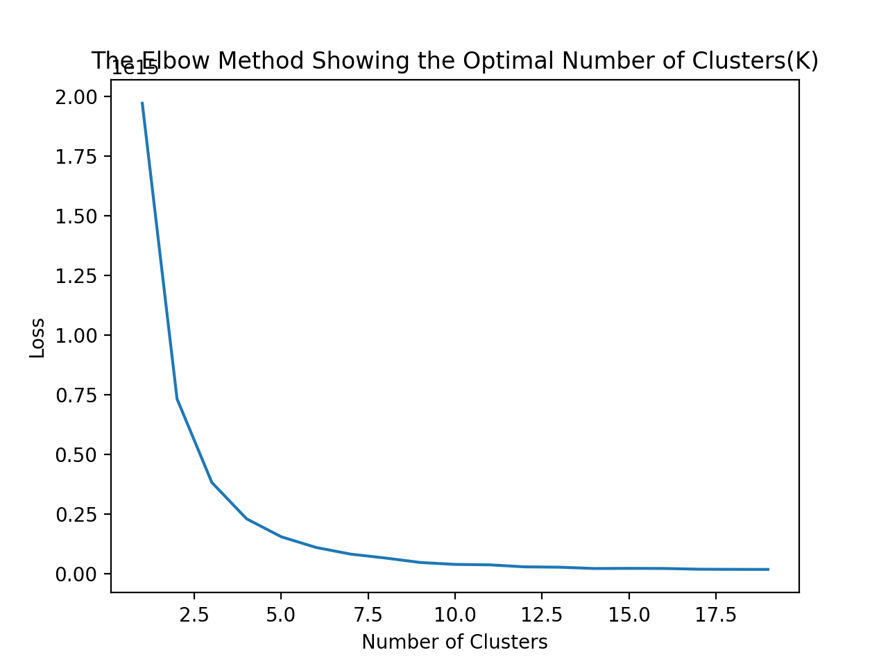
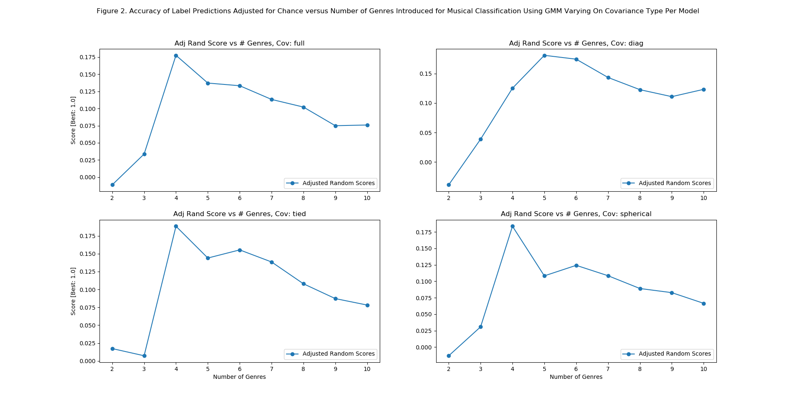
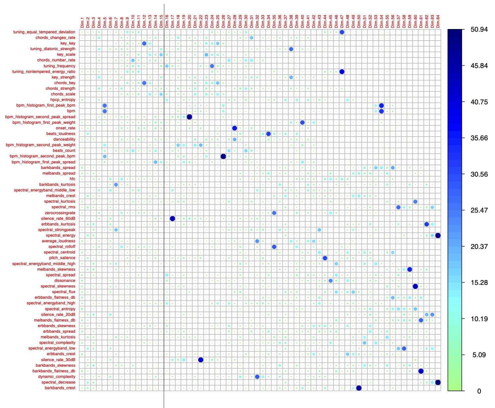

# Midterm Report

## Introduction/Background
Musical genres are categorical labels created by humans to characterize pieces of music following a hierarchical structure. The music within one genre is supposed to share more commonalities. The field of Music Genre Classification was originally introduced as a pattern recognition task by Tzanetakis and Cook [1] in 2002. Since then, it has become a widely studied problem in the Music Information Research (MIR) community. Typically, some handcrafted audio features are used as input of a machine learning classifier. Both Supervised learning and unsupervised learning can perform this task.

## Problem Definition
The act of assigning genres to music is commonly performed by humans using pattern recognition. In humans, information from past learnings are used to make inferences about new data that is encountered. However, these classifications can sometimes be opinionated and based off features that are not necessarily characteristic of a certain genre. Using machine learning, we can effectively categorize music based on concrete features used in our dataset and essentially determine the features that impact genre the most.

## Data Collection
We obtained song datasets from the online AcousticBrainz recording library. This library contains JSON-formatted attributes of hundreds of thousands of songs, with dozens of attributes per song. These include high level musical attributes such as the beats per minute and the key, as well as low level musical attributes such as the spectral RMS and ERBBands spread. most attributes are numerical, some are strings (such as the genre and key), and some are lists of numbers.

We wanted to create a common dataset from which to train each classifier. While some classifiers can handle string features, most are limited to numerical features. We also wanted to use a numpy array to represent the feature matrix, for both the performance benefits and numpy's integration with scikit-learn. Towards these goals, we wrote a utility script that opens each song recording in our data folder, converts its JSON contents into a map of features, and then constructs a feature matrix using only the numerical features available. Numerical substitutions were specified for the song's key, which was a feature we were interested in keeping. This process also generated corresponding arrays of song IDs, feature names, and the labeled genres for us to validate the classifiers.

The resulting feature matrix had 64 features. We took care to minimize memory leaks in the utility function, and experienced no issues when processing a 1000 song dataset. Such that only one of our members would need to download the dataset, we serialized the numpy matrices into files and distributed those files to group members. This allowed group members to import the matrices with only a few lines of code, and save the disk space associated with downloading the raw dataset.

## Methods
To determine the best method for assigning genres, a series of multiple methods will be implemented and their accuracies will be assessed. Dimensionality reduction by principal component analysis will be used to extract the most meaningful features for labeling. In addition, data cleaning will be implemented in order to simplify complicated labels to prevent repetitive genre labels and potnential inaccurate clustering. The following methods will be evaluated:

**Unsupervised Methods**:
1. K-Means: While not very flexible, K-Means is fast on large datasets and can serve as a baseline to compare against other clustering methods.

We used K-Means to group the data into k clusters, varying k from two to ten. The algorithm returned a cluster center with a value of the mean of all the features in the cluster. We then found the closest point to the center and the the label of this point was assigned to all the points in the cluster in the updated feature matrix. We ran this clustering algorithm on the dataset with 1000 features. As shown in the results table, the accuracy was very low for every value of k. According to the elbow graph, Figure 1, the optimal number of clusters is somewhere between three and five, with k=4 showing the highest accuracy among all results. Low accuracy is seemingly due to the similarity in labels, such as "Rock" and "Alternative Rock" that each occur only once in the dataset. This is one reason for the dimensionality reduction conducted on the data. These labels would be merged, causing these features to be grouped together in one cluster, increasing accuracy of K-Means. This is also a reason to conduct PCA, which would present only the top ten or fifteen dimensions, leading to more accurate clusters.

Figure 1:

| Labels Selected | Genre                                    | Occurances | Accuracy   |
|-----------------|------------------------------------------|------------|------------|
| 2               | Experimental; Lounge; Surf               | 558        | 0.00179211 |
|                 | Punk                                     | 442        | 0.01357466 |
|                 |                                          |            |            |
| 3               | Pop                                      | 472        | 0.05084746 |
|                 | Genre                                    | 313        | 0.00319489 |
|                 | R&B                                      | 215        | 0.02325581 |
|                 |                                          |            |            |
| 4               | Baroque - Cello                          | 357        | 0.00280112 |
|                 | Progressive Metal                        | 346        | 0.00867052 |
|                 | Soundtrack                               | 208        | 0.06730769 |
|                 | K-Pop                                    | 89         | 0.01123596 |
|                 |                                          |            |            |
| 5               | Trash Metal                              | 299        | 0.00334448 |
|                 | Electronic                               | 275        | 0.02909091 |
|                 | Vocal Jazz                               | 219        | 0.00456621 |
|                 | Rock/Pop                                 | 130        | 0.00769231 |
|                 | Trance, Electronic                       | 77         | 0.02597403 |
|                 |                                          |            |            |
| 6               | Jazz                                     | 248        | 0.06048387 |
|                 | Rock & Roll                              | 239        | 0.0083682  |
|                 | Rock                                     | 191        | 0.05759162 |
|                 | Pop                                      | 153        | 0.09150327 |
|                 | Rock/Pop                                 | 127        | 0.00787402 |
|                 | Soul                                     | 42         | 0.02380952 |
|                 |                                          |            |            |
| 7               | Post-Bop                                 | 243        | 0.00411523 |
|                 | Country                                  | 215        | 0.00930233 |
|                 | Grindcore / Noisegrind / Noisecore / Usa | 185        | 0.00540541 |
|                 | Soundtrack                               | 127        | 0.09448819 |
|                 | Free/Avant Jazz                          | 109        | 0.00917431 |
|                 | Classical                                | 93         | 0.17204301 |
|                 | Progressive Trance                       | 28         | 0.03571429 |
|                 |                                          |            |            |
| 8               | Rock                                     | 200        | 0.085      |
|                 | Jazz                                     | 198        | 0.04040404 |
|                 | Country                                  | 171        | 0.02339181 |
|                 | null                                     | 142        | 0.01408451 |
|                 | Neoclassical                             | 127        | 0.00787402 |
|                 | Unknown                                  | 81         | 0.11111111 |
|                 | R&B                                      | 64         | 0.0625     |
|                 | EBM                                      | 17         | 0.05882353 |
|                 |                                          |            |            |
| 9               | Rockabilly                               | 172        | 0.00581395 |
|                 | Rock                                     | 166        | 0.10240964 |
|                 | Idm                                      | 145        | 0.0137931  |
|                 | Classical                                | 132        | 0.08333333 |
|                 | Unknown                                  | 126        | 0.02380952 |
|                 | Electronic                               | 108        | 0.01851852 |
|                 | Alternative Rock                         | 74         | 0.01351351 |
|                 | Trance, Electronic                       | 60         | 0.03333333 |
|                 | EBM                                      | 17         | 0.05882353 |
|                 |                                          |            |            |
| 10              | Classic Rock                             | 158        | 0.00632911 |
|                 | Rock                                     | 146        | 0.0890411  |
|                 | Classical                                | 131        | 0.08396947 |
|                 | Punk                                     | 126        | 0.03174603 |
|                 | Soundtrack                               | 114        | 0.00877193 |
|                 | Electronic                               | 108        | 0.01851852 |
|                 | Metal; Heavy Metal                       | 75         | 0.01333333 |
|                 | Alternative Rock                         | 74         | 0.01351351 |
|                 | J-Pop                                    | 52         | 0.01923077 |
|                 | EBM                                      | 16         | 0.0625     |
|                 |                                          |            |            |

2. Gaussian Mixture Model: GMM has a relatively large amount of flexibility for capturing cluster covariance with respect to K-Means.

We used scikit learn’s GaussianMixture to generate our GMM. Further we leveraged GaussianMixture's Fit method to cluster our data into k clusters, varying k from 2 to 10 where k is the number of introduced genres. GaussianMixture’s Fit method leverages the Expectation Maximization algorithm to return a set of predicted labels ranging from 0 to k. We ran our GMM classifier on a dataset with 1000 observations. These observations contained 64 features each. For k clusters we also cleaned and normalized the labels associated with our observations, i.e. for k clusters we perform our data and label cleaning algorithm. Our data and label cleaning algorithm would tokenize our labels, count unique labels, and then set each label to a normalized, highest occurring label. As we cleaned our data and normalized labels we reduced data sets corresponding to the top k labels for our normalized labels. Respective to a growing k where k ranges from 2 to 10 our data set contained the following observations: 233, 304, 383, 399, 416, 428, 451, 518, and 584. Further, we’ve plotted (Figure 2) these k-observations pairings against their adjusted random score for each of four covariance types: full, diagonal, tied, and spherical.

Figure 2:

**Supervised Methods**:
1. Random Forest Classifier: Random Forest Classifier works well with non-linear, high dimensional data. While we do not yet know the linearity of our dataset, this method would prove advantageous if our dataset is non-linear.

The random forest classifier is implemented using the sklearn library’s Random Forest function. In essence, a matrix consisting of music features with corresponding observations along with ground truth labels is passed to a training function which splits the training and test data by 25/75, 50/50, and 75/25 percentages. Additional splitting distributions will be tested in the future. Using the raw dataset with no preprocessing, the following preliminary metrics are observed:

| % Training/Testing | 75/25 | 50/50 | 25/75 |
| ------------------ | ----- | ----- | ----- |
| F1 Score           | 0.03  | 0.02  | 0.01  |
| Recall             | 0.04  | 0.02  | 0.02  |
| Precision          | 0.03  | 0.02  | 0.02  |

Clearly, these results are not indicative of accurate classification. In an effort to improve these classifications, we have decided to implement up stream, preprocessing of the data. We believe that Random Forest classification will improve in accuracy once the data and labels have been cleaned, and certain features are kept and removed.

2. Support Vector Machine: Support Vector Machines (SVM) are known to be memory efficient and are effective in high-dimensional spaces. However, SVMs are known to have high runtimes when used to classify datasets with a high number of features. We created an SVM classifier, leveraging scikit-learn for an optimal implementation. However, when training the 
SVM with the dataset, the training took more than an hour. We will therefore evaluate the effectiveness of SVMs after reducing the dimensionality of the dataset.

3. XGBoost: XGBoost is a flexible decision-tree based method which utilizes non-greedy tree pruning and built in cross validation methods to predict errors with many parameters that can be fine-tuned for optimal clustering.

The Jaccard index of XGBoost classification algorithm is 8.00% in the raw dataset. The biased dataset is one reason of the poor performance. The predicted labels are all “Rock”, and the “Rock” label is the most common label in the training set. We need to resample the dataset and make sure each music genre is represented equally.

## Results

**Dimensionality Reduction**:

Removing noise from a dataset is essential to efficient and accurate classification in machine learning, as the saying goes, “garbage in, garbage out!” After observing poor classification results after implementing various methods on the raw dataset, it is clear some kind of method is necessary to identify and keep informative features and remove potentially uninformative features. We decided implementing Principal Component Analysis (PCA) is appropriate for this task. PCA was implemented in R using the prcomp function on the raw dataset as a matrix. This function centers and scaled the data, then computes the standard deviations of each principal component (PC). 

A scree plot (Figure 3) has been generated to determine how many PC’s to include, which we found to be sufficient for 15 PCs.

Figure 3:

We assessed the amount of contribution each feature (Figure 4) gives to a dimension in order to determine which features are necessary to keep. 

Figure 4:

Of the 64 total features, we found that for the top 10 contributions for each dimension from 1 to 15, 51 features should be optimal for providing valuable information for classification. While testing our classification methods, this number may change. We expect the 13 features of lowest contributions to dimensions 1 to 15 to not provide adequate information, or even misleading information, for accurate classification.

## Discussion

Based on the preliminary results from running the classifiers on the raw data set, it is not yet clear which methods work better than others. The proposed methods run on the raw dataset have all shown to have poor classification results. As music can often blend genres, we expect resulting clusters to be noisy, however we anticipate that we can improve these results by cleaning the data and reducing the number of features.

1. Data Cleaning

The AcousticBrainz dataset gathered the music genre labels from various metadata sources like AllMusic and Last.fm. Some sources rely more on experts’ annotations following a more standardized taxonomies, and other sources are largely based on collaborative tagging from general users of those platforms. In short, the genre labels contains abbreviations (“alternative” and “alt”), synonyms (“rap” and “hip-hop”), non-genre tags (“female”), sub-genres (“house” and “techno” for electronic genre), and languages other than English (“힙합” in Korean for hip-hop genre). We took the effort to simplify many tags to standard music genre labels. Because the nature of music genre classification being subjective and controversial, there is no way to create an exhausted list of all possible genres. Thus, we decided to select the top N most common labels for our research, and discard other less recognized music genres. 

2. Dimensionality Reduction

Since we have implemented work flows to clean the dataset and identify informational features, we plan to next run our classifier methods again on a processed dataset with cleaner labels and extracted features.

Since the song genres do not follow a standard, some song genres have extra characters, different spellings, or niche genre names that can be grouped with others. This challenges us because the clustering algorithms do not consider that various subgenres are related, so niche subgenres can harm the accuracy of related genres. For example, the 1000 song dataset has separate genres for "electro", "tech", "dance", and "house", all forms of electronic music. We combined these genres into "electronic". Also, some songs have multiple genres, such as "dance; country". We will later discuss whether to try accounting for multiple genres in the dataset, or whether to discard songs from those fringe genres. As we increase the dataset size we will look futher into which broad genres we wish to consider.

Our experiments aim to grade different clustering methods based on their capability in musical classification. We hope to discern effective algorithms for music genre classification, and have shown substantial progress towards this. Additionally, we may attempt to increase the number of genres classified to divide broad genres into sub-genres.

## References
G. Tzanetakis and P. Cook, "Musical genre classification of audio signals," in IEEE Transactions on Speech and Audio Processing, vol. 10, no. 5, pp. 293-302, July 2002, doi: 10.1109/TSA.2002.800560.

Bogdanov, D., Porter A., Schreiber H., Urbano J., & Oramas S. (2019).
The AcousticBrainz Genre Dataset: Multi-Source, Multi-Level, Multi-Label, and Large-Scale.
20th International Society for Music Information Retrieval Conference (ISMIR 2019).

Oramas, S., Barbieri, F., Nieto, O., & Serra, X. (2018). Multimodal Deep Learning for Music Genre Classification. Transactions of the International Society for Music Information Retrieval, 1(1), 4–21. DOI: http://doi.org/10.5334/tismir.10

 Pedregosa et al., Scikit-learn: Machine Learning in Python, JMLR 12, pp. 2825-2830, 2011.
