# Final Report

## Introduction/Background

Musical genres are categorical labels created by humans to characterize pieces of music following a hierarchical structure. The music within one genre is supposed to share more commonalities versus music across differing genres. The field of Music Genre Classification was originally introduced as a pattern recognition task by Tzanetakis and Cook [1] in 2002. Since then, it has become a widely studied problem in the Music Information Research (MIR) community with many challenges being faced to correctly and consistently catergorize music by genres. Typically, some handcrafted audio features such as beats per minute, chord scales, and tuning frequency are used as input of a machine learning classifier. Both supervised  and unsupervised classifiers are believed to be able to perform music genre classifications using these types of features. 

## Problem Definition

Assigning genres to music is commonly performed by humans using pattern recognition. However human labeling is problematic because of labeling inconsistencies and inaccuracies due to individual human biases. This leads to datasets containing multiple equivalent labels (for example "hiphop", "hip-hop" and "hip hop"), mutually inclusive genres such as "iranian folk" and "middle eastern folk", inaccurate labels, and other variations that weaken the dataset's structure. For applications such as song recommendation engines, which rely on metadata including the labeled genre, a well-formed and consistent dataset is highly beneficial. By using machine learning classifiers to learn characteristic genre features, we can effectively classify songs into their best-fit genres and remove human inconsistencies.

## Data Collection

We obtained song datasets from the online AcousticBrainz recording library. This library contains JSON-formatted attributes of hundreds of thousands of songs, with dozens of attributes per song. These include high level musical attributes such as the beats per minute and the key, as well as low level musical attributes such as the spectral RMS and ERBBands spread. Most attributes are numerical, some are strings (such as the genre and key), and some are lists of numbers.

A common dataset was created from which to train each classifier. While some classifiers can handle string features, most are limited to numerical features. We used a numpy array to represent a feature matrix, for both the performance benefits and numpy's integration with scikit-learn. Towards these goals, we wrote a utility script that opens each song recording in our data folder, converts its JSON contents into a map of features, and then constructs a feature matrix using only the numerical features available. Numerical substitutions were specified for the song's key, which was a feature we were interested in keeping. This process also generated corresponding arrays of song IDs, feature names, and the labeled genres for us to validate the classifiers.

The resulting feature matrix had 64 features. We took care to minimize memory leaks in the utility function, and experienced no issues when processing a 15,000 song dataset. Such that only one of our members would need to download the dataset, we serialized the numpy matrices into files and distributed those files to group members. This allowed group members to import the matrices with only a few lines of code, and save the disk space associated with downloading the raw dataset. The final, raw dataset consisted of 15,000 songs. After cleaning this dataset to consolidate similar genres and filter out badly-formed data, 11,000 songs remained for downstream analysis with 19 genre labels (**Figure 1**):

**Figure 1: Final Labeled Dataset**

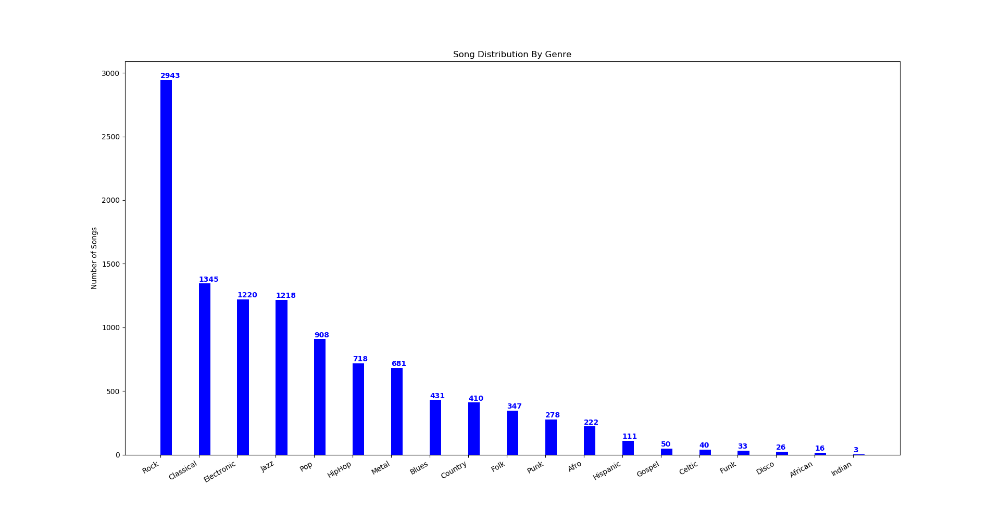

Because machine learning models in general have been used to predict labels for unlabeled data using only features for observations, we believed it would be possible to test and find a machine learning algorithm that can accurately predict genre labels for an unlabeled song. A limitation in this approach is that while 64 features seems like a lot of dimensionality, it may not be enough. Many studies require hundreds or even thousands of features for accurate classifications, so it is possible that the 64 features we have in this dataset may not be enough to accurately label songs by their genres, regardless of how capable the machine learning methods we test seem to be. Previously, applying these machine learning methods on the raw dataset exhibited poor results in accurately identifying each song's genre. Therefore, we have decided to implement two steps in pre-processing the dataset in order to increase accurate classifications. First, dimensionality reduction by principal component analysis (PCA) was implemented to extract the most meaningful features and remove noisy ones. Second, a data cleaning step is implemented in order to simplify redundant and inconsistent labels. Both of these steps are described in the Methods section.

## Methods

To compare the effectiveness of difference classification methods on this data, several classifiers were implemented and their accuracies were evaluated. Dimensionality reduction by principal component analysis (PCA) was used to extract the most meaningful features for genre predictions. A scree plot was generated to narrow a set of dimensions to utilize and maintain variance according to the elbow point of the curve (**Figure 2**). The contribution for each feature per dimension was computed (**Figure 3**) and used to select the reduced dimensions.

**Figure 2: Scree Plot**
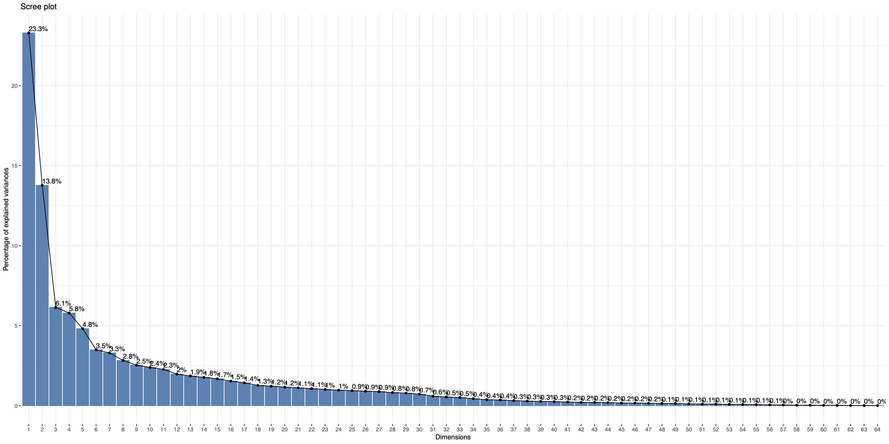

**Figure 3: Feature Contribution Plot**
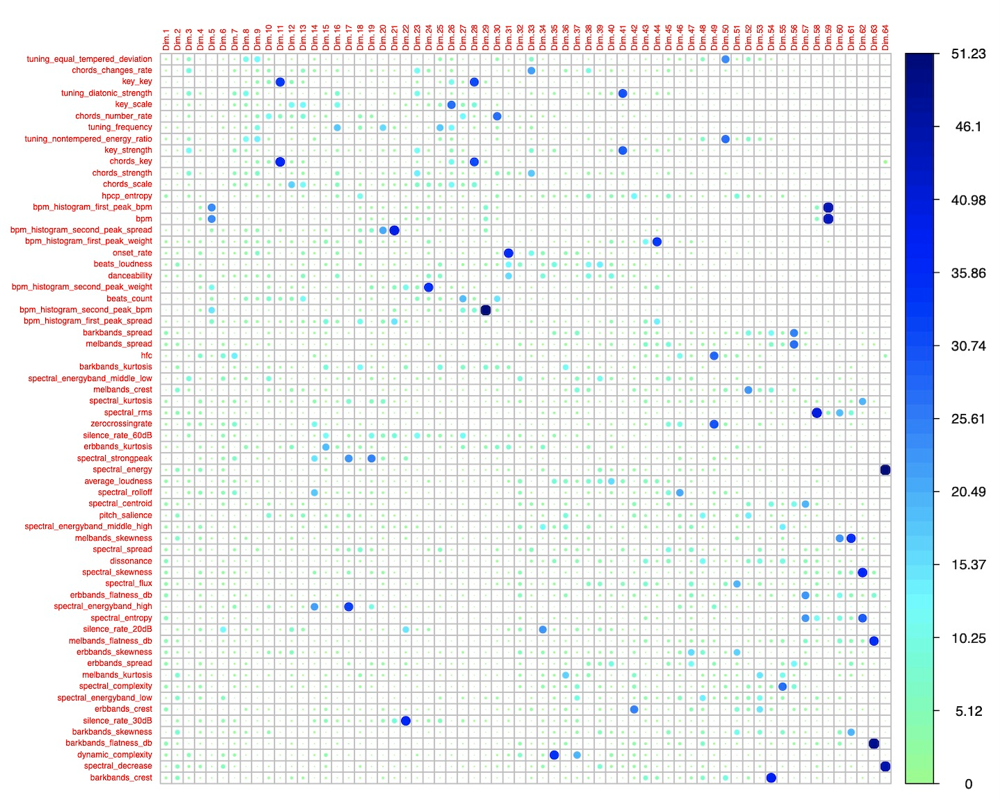

For each set of dimensions we tested (dimensions 1-7, 1-10, 1-13), we found the top n features of highest contribution per dimension (either top 3 or top 10 per dimension). This allowed us to trial the classifiers on a variety of useful feature sets. Consistently, the top contributing features included "chords changes rate", "spectral rolloff", and "key strength" while "spectral speed", "average loudness" and "spectral centroid" seemed to consistently contribute the least amount of information and were typically excluded after dimensionality reduction. The following parameters for dimensionality reduction and feature extraction were tested across models in order to understand how many features seemed to aid in accurate classifications (**Table 1**):

**Table 1: No. Features Kept Following Dimensionality Reduction**

|  **Dimensions Kept**  |**Top n Contributing Features per Dimension**|**Kept Features / Total Features**|
| ----------- | ----------- | ----------- |
| 1-7       |   3       | 17/64 |
| 1-7       |   10       | 48/64 |
| 1-10       |   3       | 23/64 |
| 1-10       |   10       | 56/64 |
| 1-13       |   3       | 28/64 |
| 1-13       |   10       | 58/64 |

In addition, a data cleaning script was created to standardize the ground truth genre classifications. As the dataset genre labeling was collected from a variety of sources, labels were inconsistent or vague for a high number of songs. For example, "hip hop", "hip-hop", and "hiphop" were all used for hip-hop. Also, several genres were closely related, such as numerous subgenres of rock and electronic music. We chose to group subgenres together by reviewing the genres represented in the dataset and combining closely related genres until the remaining genres had very few (1-20) songs represented. For example, "electronic", "trance", "house", and "edm" were all combined. This resulted in the 19 genres shown in **Table 1**, fitting 11,000 of the 15,000 songs to a standard set of genres. The remaining songs had either malformed or negligibly represented genres, such as "australian folk".

While combining closely-related genres does remove granularity in the data, we felt that since genres are being considered as independent attributes the closely-related genres would be detrimental to the classifiers' accuracies. For example, "classic rock" and "alternative rock" are symphonically similar so it would be difficult for classifiers to uniquely differentiate between them. Also, musical performances tend to vary greatly between songs and artists within a genre, so we expected substantial overlap between similar genres. Successfully classifying broader genres with high accuracy would be a more rewarding goal than achieving low accuracy with many genres.

After extracting meaningful features and cleaning the dataset's labels, five machine learning applications were implemented to determine:

1. Which (if any) machine learning classifying methods perform accurately?
2. Which (if any) machine learning classifying methods perform poorly?
3. How many dimensions and features are required to improve classification accuracy?
4. Can music genres be accurately predicted based on this dataset?

Accuracy scores were computed for each method and dimensionality reduction implementation as described in **Table 2** to compare the accuracy of genre predictions across five machine learning methods: K-Means, Gaussian Mixture Model, Random Forest Classifier, Support Vector Machine, and XGBoost.

**Unsupervised Methods**:
1. K-Means: While not very flexible, K-Means is fast on large datasets and can serve as a baseline to compare against other clustering methods.

2. Gaussian Mixture Model: GMM has a relatively large amount of flexibility for capturing cluster covariance with respect to K-Means.

**Supervised Methods**:
1. Random Forest Classifier: Random Forest Classifier works well with non-linear, high dimensional data. While we do not yet know the linearity of our dataset, this method would prove advantageous if our dataset is non-linear.

2. Support Vector Machine: Support Vector Machines (SVM) are known to be memory efficient and are effective in high-dimensional spaces. 

3. XGBoost: XGBoost is a flexible decision-tree based method which utilizes non-greedy tree pruning and built in cross validation methods to predict errors with many parameters that can be fine-tuned for optimal clustering.

## Results

Each machine learning classifier's accuracy has been evaluated to determine which methods can predict music genres with the least and most accuracy.

**Unsupervised Methods**:

**1. K-Means**:
K-Means: We used K-Means to group the data into k clusters, varying k from two to ten. The algorithm returned a cluster center with a value of the mean of all the features in the cluster. We then found the closest point to the center and the the label of this point was assigned to all the points in the cluster in the updated feature matrix. We ran this clustering algorithm on the dataset with 11,000 features. According to the elbow graph, **Figure 4**, the optimal number of clusters is somewhere between three and five, with k=4 showing the highest accuracy among all results. 

**Figure 4: K-Means Elbow Plot**

We ran K-Means clustering on 6 trials. Each trial is characterized by a different set of extracted features which, in order, are: 7 dimensions with the top 3 features, 7 dimensions with the top 10 features, 10 dimensions with the top 3 features, 10 dimensions with the top 3 features, 10 dimensions with the top 10 features, 13 dimensions with the top 3 features, and 13 dimensions with the top 10 features. **Figure 5** illustrates the feature clusters produced for each trial by running K-Means along with each feature’s accuracy based on each datapoint’s truth value:

**Figure 5: K-Means Clusters per Trial**
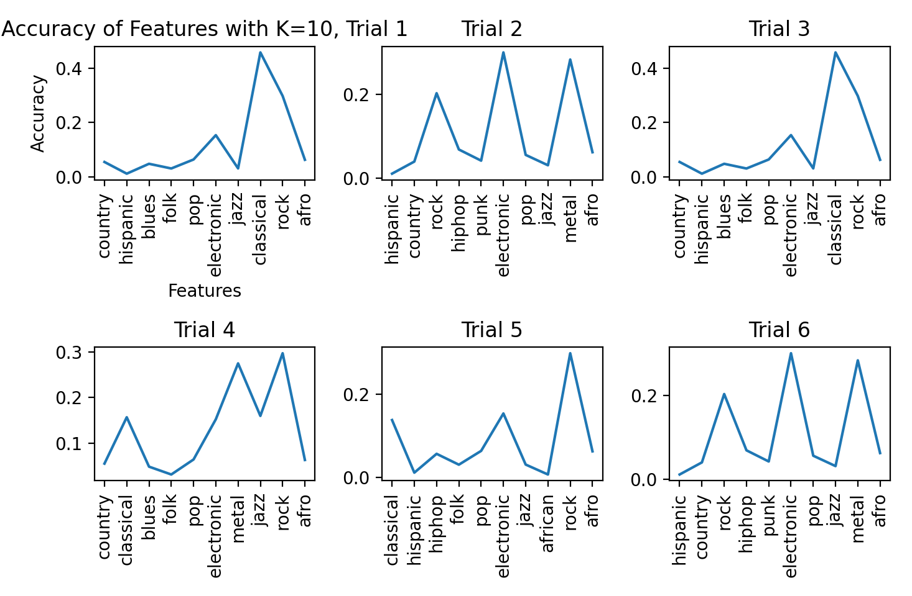

Graphed below is the average accuracy of each trial.

**Figure 6: K-Means Accuracies**
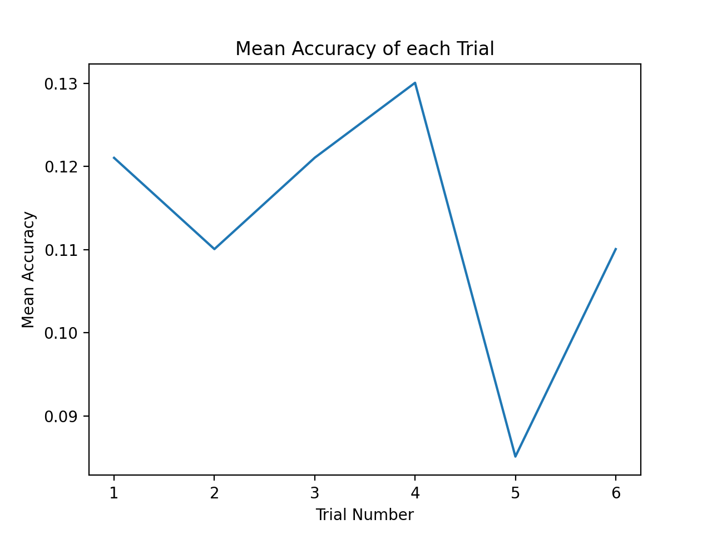

We can see that trial 4 had the highest accuracy of 13.00% and trial 5 had the lowest accuracy of 8.5%.

**2. Gaussian Mixture Model**: The Gaussian Mixture Model is implemented using the sklearn library’s Gaussian Mixture Model function given inputs of varied covariance type, maximum iterations for covergence set to 50,000, and init_param set to initialize clusters by 'kmeans'.

**Figure 7A: GMM Accuracy**
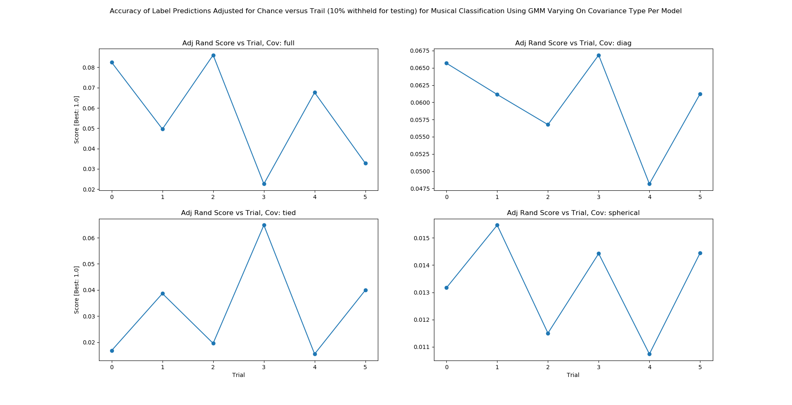
From **Figure 7A** we show the accuracy given the covariance type of either full, tied, diagonal, or spherical. **Figure 7A** displays accuracy graphed along 6 trials. Each trial is characterized by a different set of extracted features which, in order, are: 7 dimensions with the top 3 features, 7 dimensions with the top 10 features, 10 dimensions with the top 3 features, 10 dimensions with the top 3 features, 10 dimensions with the top 10 features, 13 dimensions with the top 3 features, and 13 dimensions with the top 10 features. We find very low accuracies with the mean accuracy across each covariance type and each trial being: diagonal = F1 score of .06, full = F1 score of .06, tied = F1 score of .03, spherical = F1 score of .01.

**Figure 7B: GMM Stability**
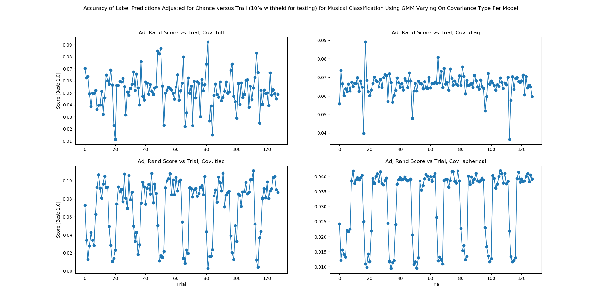

The aim of **Figure 7B** is to demonstrated stability of GMM across 4 covariance types given our data set. From **Figure 7B** we show the accuracy given the covariance type of either full, tied, diagonal, or spherical. **Figure 7B** displays accuracy graphed along trials where there are 128 trials. Each trial is characterized by a different set of extracted features increasing with trial number. Where Trial = {Trial 1, Trial 2, ..., Trial 128} we can represent our trials as Trial = {6_Dimensionsx2_Features, 6_Dimensionsx3_Features, ..., 13_Dimensionsx32_Features}- dimensions range 6 to 13 (inclusive) and features range 2 to 32 (inclusive). Given the various covariance matrices for our GMM, a diagonal covariance matrix provides the most stable result given our data set. Given a diagonal covariance matrix, our GMM produced an accuracy with a variance of approximately 3.52x10-5. Thus, we say that for GMM given the nature of our data we expect a stable accuracy from a GMM parameterized by a diagonal covariance matrix.

**Figure 7C: GMM Asessment of Accuracy on Subsetted Data**
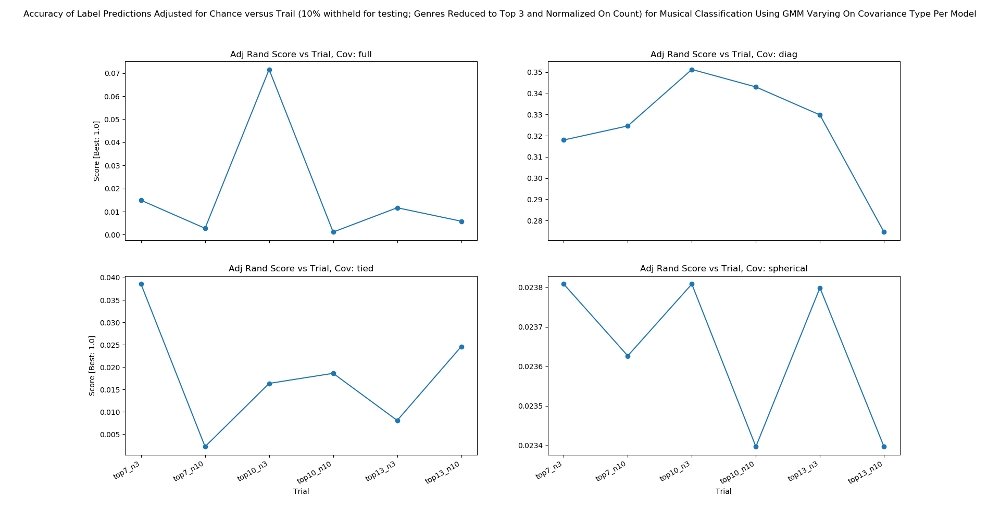

As seen in **Figure 7C** we find that the mean accuracy of our GMM yields an F1 score of .33 when performed on the top 3 genres (Electronic, Classic, Rock) and each genre normalized to be equally represented with 10% of our data withheld for testing. This jump in accuracy was found in part from K-Means performance testing (as mentioned the peak accuracy for K-Means was found between 3 and 5 clusters in our midterm report). Further, we note from experimentating with various inputs that our accuracies tend to drop off as we increase the number of genres introduced to our GMM.

**Supervised Methods**:

**1. Random Forest Classifier**: The random forest classifier is implemented using the sklearn library’s Random Forest function.
Using the raw dataset with no preprocessing, the following preliminary metrics were previously observed in **Table 2**:

**Table 2: Raw Data Implementation** 

| % Training/Testing | 75/25 | 50/50 | 25/75 |
| ------------------ | ----- | ----- | ----- |
| F1 Score           | 0.03  | 0.02  | 0.01  |
| Recall             | 0.04  | 0.02  | 0.02  |
| Precision          | 0.03  | 0.02  | 0.02  |

Clearly, the results for F1, Precision and Recall scores indicate poor accuracy in predicting each song's genre. After dimensionality reduction and data cleaning, a matrix consisting of music features with corresponding observations along with labels is passed to a training function which splits the training and test data by 10/90, 25/75, 50/50, 75/25, and 90/10 percentages. For each implementation, F1, Precision and Recall scores improved overall, indicating the importance of removing even just a few uninformative features and cleaning the dataset (**Figure 8**):

**Figure 8: Random Forest Accuracy Metrics for Various Dimensionality Reduction Parameters**
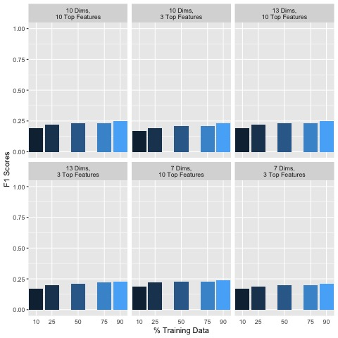
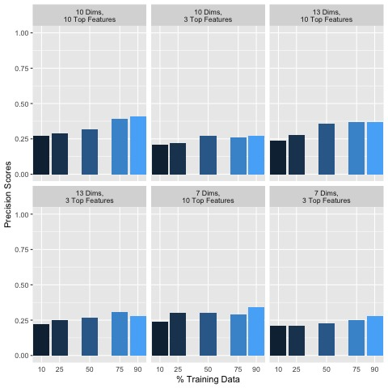
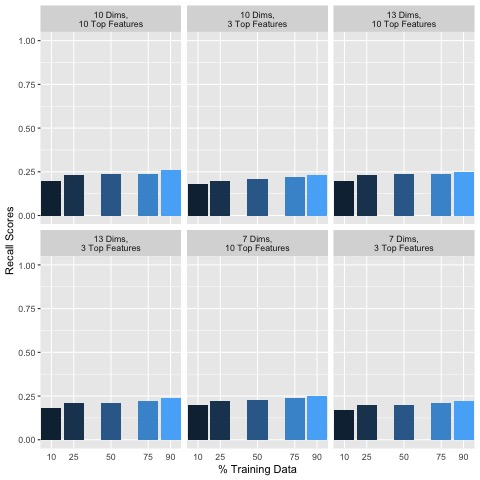

Generally, including more data in the training set seemed to improve classification accuracy. In addition, keeping more features and dimensions tended to also improve classification accuracies. Additional empirical testing was conducted to obtain better insight into optimal dimensionality reduction parameters. Given that overall using 90% of the data for training set and 10% for the test set performed the best, the following F1, Precision and Recall scores are shown in **Figure 9** for this 90/10 training/testing split for various additional dimensionality reduction parameter testing:

**Figure 9: Test Size 10% Accuracies**

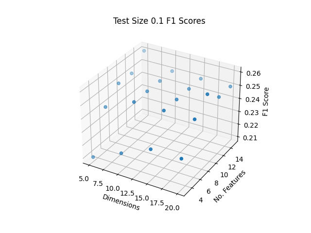
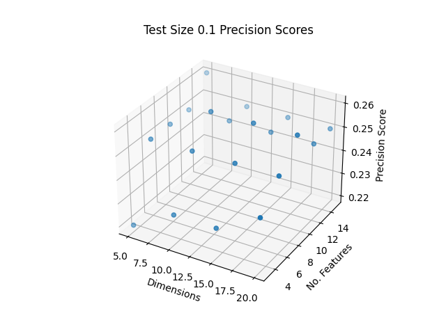
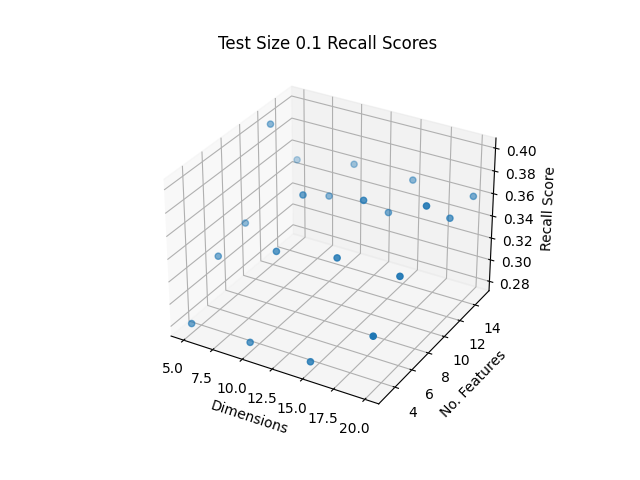

The best F1, Precision and Recall Scores were obtained as shown in **Table 3** with the top score indicated in bold:

**Table 3: Top Scores**

| Dims | Top Contrib. Feats per Dimension | F1 Score | Precision Score | Recall Score |
| ------- | --------------------------------------------| ------------| ---------------------- | --------------- |
| 1-20 | 9 | **0.26** |0.39 | **0.26** | 
| 1-5 | 12 |0.25| **0.40** |0.25|

The highest F1 and Recall Scores were obtained from the same set of parameters, with using dimensions 1-20 and the top 9 contributing features per dimension. The highest Precision Score was found from using dimensions 1-5 and the top 12 contributing features. While it is not clear whether the number of dimensions or the number of top contributing features per dimension play a more important role in accuracy, it does seem that there is a trade off in using too many/few dimensions or features may reduce the accuracy. Empirical testing shown here may help to optimize parameters to improve the random forest classifier, however these may be different for other machine learning methods.

The top F1, Precision and Recall scores are 0.26, 0.40, and 0.25 respectively, and are generally poor in accurately classifying songs by their genre based on this dataset. However, dimensionality reduction and data cleaning has improved classification overall. It is possible that additional kinds of features that may exist for songs may improve genre classification accuracy using Random Forest.

**2. Support Vector Machine (SVM)**: 
SVM is known to be a generally effective classifier for high dimensional data, however suffers from a long training time with larger dataset sizes. We used sklearn's SVM implementation for it's optimizations, and trialed the classifier by training on 90% of the dataset (randomly selected) and testing on the remaining 10%. As warned by sklearn and the lectures, fitting SVM to the dataset took hours to complete, however the F1 scores were refreshingly accurate. **Table 4** shows the F1 scores for the SVM implementation with each dimension and feature set trialed.

**Table 4: SVM F1 Results**

| %Training/Testing | Dims | Top Contrib. Feats per Dimension | F1 Score | 
| ----------------- | ---- | ---------------------------------| ---------|
| 90/10 | 1-7 | 3 | 0.42 |
| 90/10 | 1-7 | 10 | 0.48 |
| 90/10 | 1-10 | 3 | 0.43 |
| 90/10 | 1-10 | 10 | 0.51 |
| 90/10 | 1-13 | 3 | 0.44 |
| 90/10 | 1-13 | 10 | 0.53 |

As expected, with more features represented in the data the F1 accuracy scores increased, as shown in **Figure 10** below. However the reduced feature set still provided effective results comparable to the other classification methods, and at a greatly reduced training time. The lower-feature datasets had training times of around 1 hour, while the higher-feature datasets took up to 7 hours to train. Overall SVM is shown to be an effective genre classifier.

**Figure 10: SVM F1 Scores**

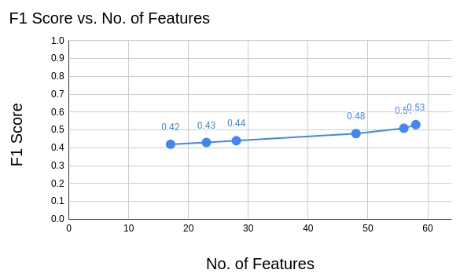

**3. XGBoost**:
XGBoost is a flexible decision-tree based method which utilizes non-greedy tree pruning and built in cross validation methods to predict errors with many parameters that can be fine-tuned for optimal clustering. Previously on the raw dataset with a test size of 10%, the accuracy of the XGBoost classification algorithm was poor at 0.08, however after dimensionality reduction and data cleaning, the following F1 scores are obtained as shown in **Figure 11**:

**Figure 11: 6 Trials F1 Scores**

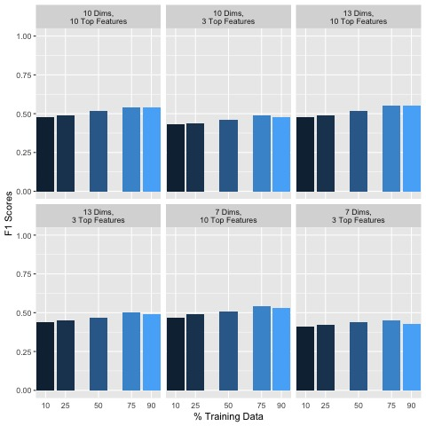

Generally, including more data in the training set did not seem to significantly improve classification accuracy. However, keeping more features and dimensions tended to improve classification accuracies. Additional empirical testing was conducted to obtain better insight into optimal dimensionality reduction parameters. The top F1 score obtained was 0.55, with a test size of 25%, shown in **Figure 12**:

**Figure 12: Test Size 25% Accuracies**

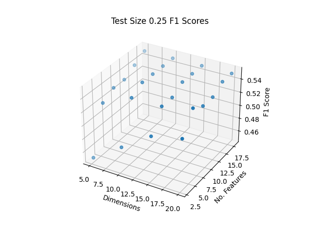

While it is not clear whether the number of dimensions or the number of top contributing features per dimension play a more important role in accuracy, it does appear that a trade-off exists. Empirical testing shown here may help to optimize parameters to improve classification by XGBoost, however these may be different for other machine learning methods.

The top F1 Score being 0.55 is generally poor in accurately classifying songs by their genre based on this dataset, however in comparison to the other machine learning methods tested, XGBoost had the consistently highest accuracy overall. Dimensionality reduction and data cleaning did help to improve classification overall. It is possible that additional features that may exist for songs may improve genre classification accuracy using XGBoost.

## Discussion
The highest performing classifiers were SVM and XGBoost, reaching F1 scores of .53 and .55 respectively. While this performance is not amazing, it indicates that machine learning classifiers have high potential for use in genre classification. The AcousticBrainz website lists their best classifiers as able to classify with ~95% accuracy. Comparatively, there were several areas of improvement that we expect would have increased our F1 scores. The dataset we selected contained the metadata for 15,000 songs, which while seemingly high also contained substantial class imbalances, with some genres containing thousands of songs and others containing less than 20. Using a larger dataset (on the order of 500,000 instead of 15,000) and balancing the classes could greatly improve the effectiveness of the classifiers. Regardless of these potential improvements, classifying genres is inherently challenging -- even for humans -- and our results are highly satisfactory.

K-Means performed with moderate classification accuracy comparable to Random Forest. Generally, using less features increased accuracy due to removing noise from the dataset which may contribute to inaccurate labeling. While K-Means consistently performed better than GMM, both SVM and XGBoost consistently outperformed with better accuracy. 

Gaussian Mixture Models (GMM) performed with moderate classification accuracy-F1 score of .33- when performed on a subset of our team dataset (6 trials) given a diagonal covariance. We notice stable performance for GMM across diagonal and full covariance types but for tied and spherical covariance types the accuracy improves as the number of features increases. Using less genres drastically improved accuracy, and using a diagonal covariance type provided a stable output. GMM has demonstrated a relatively weak performance across the classifiers in our group’s experiments.

Compared to the other machine learning classifiers, the Random Forest classifier was relatively fast in training and predicting genres, about two minutes per trial. In general, using more data for the training set increased classifying accuracies, as well as retaining more features and dimensions. While generally performing better than GMM and similar to K-Means, Random Forest performed worse overall compared to SVM and XGBoost.

SVM was one of the most effective classifiers, with similar performance to XGBoost and superior performance to Random Forest, GMM, and K-Means. While the training time was substantial, the high performance shows that genres can be classified by dividing the data into high dimensional spaces. The tradeoff of performance vs training time makes SVM less desirable for this application, especially if we chose to train an SVM on a larger dataset. In that case, using a classification algorithm with similar results to SVM but a shorter training time would be preferred.

Since XGBoost out-performs SVM and Random Forest in supervised learning, It is necessary to understand the advantage of its algorithm. XGBoost, fully known as Extreme Gradient Boosting, is a more recent machine learning algorithm proposed by Chen and Guestrin in 2016 [5]. It is an improvement of the ensemble tree learning algorithms such as Random Forest. Compared to bagging, the parallel ensemble learning technique in Random Forest, XGBoost uses boosting, a sequential gradient ensemble learning method, that decreases the error for each new model overtime. Gradient tree boosting is also known as gradient boosting machine (GBM) or gradient boosted regression tree (GBRT). Furthermore, cross-validation is used at each iteration of the boosting process which is an enhancement from the grid search in GBM. We chose the tree-based model in XGBoost as it usually out-performs the linear model. Other important parameter settings: maximum depth equal to 10, learning rate equal to 0.1, number of tree estimators set to 150.

## Conclusions
In this project, we compared two unsupervised learning algorithms and three supervised learning algorithms towards the task of musical genre classification. The input attributes are the handcrafted low-level audio features and high-level music features retrieved from the audio signals of thousands of songs. The ground truths in this dataset are the genre labels provided by public annotations. Because of the large amount of audio features and the inconsistency of the labels, two steps of pre-processing were implemented with dimensionality reduction by PCA and genre data cleaning to improve the accuracy of the classifiers and structure of the data. After this pre-processing, the classification results improved significantly. The highest accuracy achieved was an F1 score of 0.55 using the XGBoost classifier. This result proves that data-driven methods are capable of performing a modest job in music genre classification.

## Contributions

The following contributions were made by each team member:

1. Jack Kolb: 
- Implemented data collection and pre-processing for the rest of the group to easily obtain and use the dataset
- Created the videos for the project proposal and final report
- Assisted in data cleaning work flow
- Subset matrices for final implementations
- Implemented and assessed SVM
- Made significant written contributions to each report

2. Kelian Li:
- Came up with the initial idea of labeling music by genres
- Provided the original dataset
- Implemented and assessed XGBoost
- Aided in the group's understanding of music technology features and problem definition 
- Made significant written contributions to each report

3. Jameel Abbess:
- Major contributor to the data cleaning work flow
- Took care of "administrative duties" such as setting up BlueJeans meetings, submitting project deliverables, etc.
- Implemented and assessed GMM
- Made significant written contributions to each report

4. Henna Mian:
- Assisted in data cleaning work flow
- Took care of submitting project deliverables and setting up mark down files
- Implemented and assessed KMeans
- Made significant written contributions to each report

5. Maggie Brown:
- Implemented PCA and dimensionality reduction
- Implemented and assessed random forest
- Partial implementation and assessment for XGBoost
- Made significant written contributions to each report

## References
G. Tzanetakis and P. Cook, "Musical genre classification of audio signals," in IEEE Transactions on Speech and Audio Processing, vol. 10, no. 5, pp. 293-302, July 2002, doi: 10.1109/TSA.2002.800560.

Bogdanov, D., Porter A., Schreiber H., Urbano J., & Oramas S. (2019).
The AcousticBrainz Genre Dataset: Multi-Source, Multi-Level, Multi-Label, and Large-Scale.
20th International Society for Music Information Retrieval Conference (ISMIR 2019).

Oramas, S., Barbieri, F., Nieto, O., & Serra, X. (2018). Multimodal Deep Learning for Music Genre Classification. Transactions of the International Society for Music Information Retrieval, 1(1), 4–21. DOI: http://doi.org/10.5334/tismir.10

Pedregosa et al., Scikit-learn: Machine Learning in Python, JMLR 12, pp. 2825-2830, 2011.

Chen, Tianqi, and Carlos Guestrin. "Xgboost: A scalable tree boosting system." Proceedings of the 22nd acm sigkdd international conference on knowledge discovery and data mining. 2016.

Christopher M. Wilson, Brooke L. Fridley, José Conejo-Garcia, Xuefeng Wang, Xiaoqing Yu. Wide and Deep Learning for Automatic Cell Type Identification. bioRxiv 2020.10.09.328732; doi: https://doi.org/10.1101/2020.10.09.328732
Now published in Computational and Structural Biotechnology Journal doi: 10.1016/j.csbj.2021.01.027

